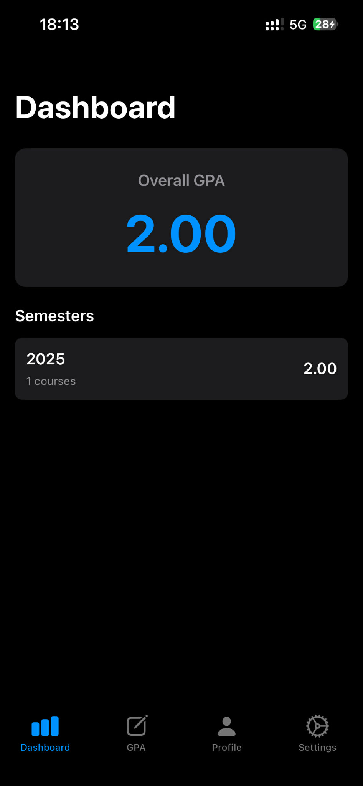
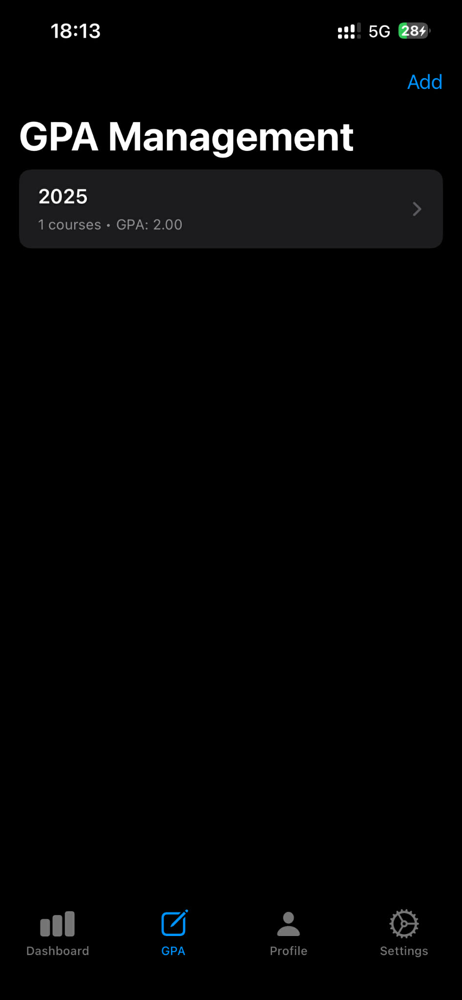
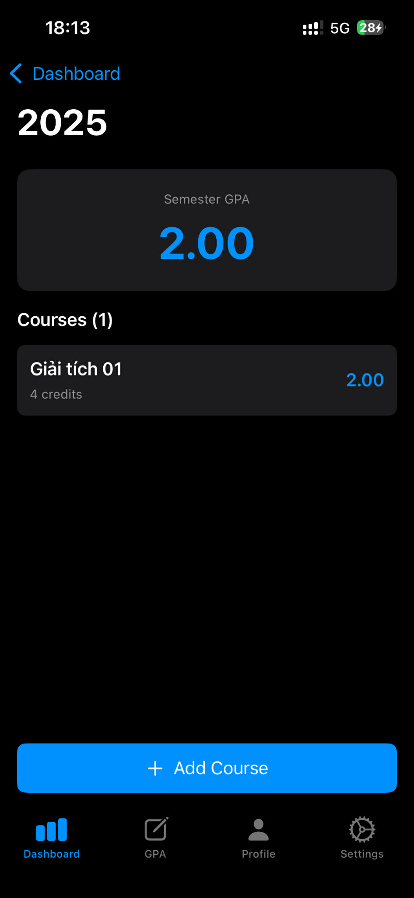
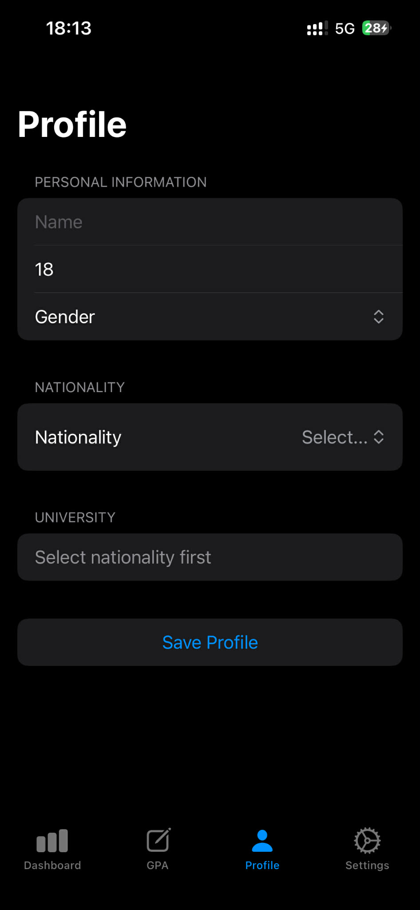
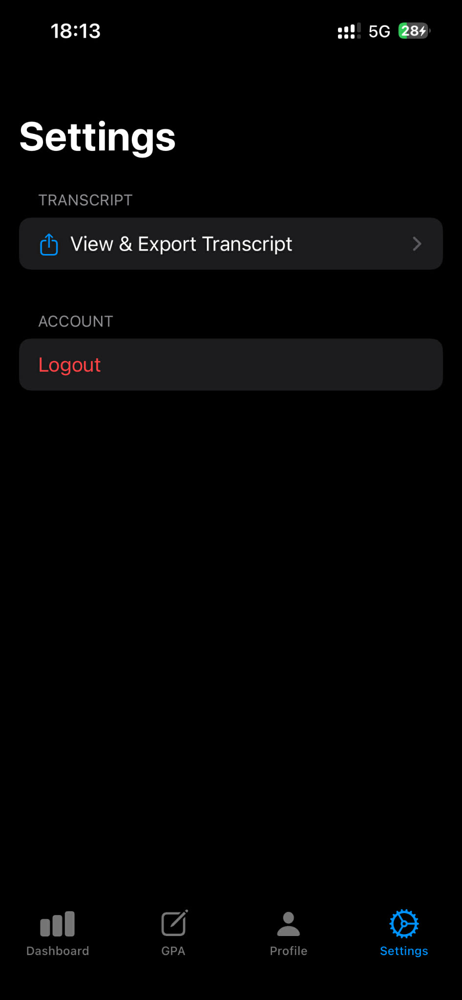

# Student GPA Manager - iOS Application

A comprehensive iOS application built with SwiftUI for managing student academic progress, GPAs, semesters, and courses.

## Features

Authentication
- Email/Password-based Firebase Authentication
- Secure login and registration
- User session management
- Session persistence

Student Profile Management
- Complete student profile with personal information
- Name, age, nationality, gender, university selection
- Local data persistence with UserDefaults
- Profile editing and saving

University & Nationality Selection
- Integration with Hipolabs University API for university data
- Integration with REST Countries API for country selection
- Dynamic university filtering by country
- Searchable university and country lists

GPA Management System
- Semester-based GPA organization
- Course management with credits and grades
- Weighted GPA calculation based on credits
- Overall GPA tracking and statistics
- Support for multiple semesters

Academic Dashboard
- Overall GPA display
- Semester overview with detailed statistics
- Quick semester navigation
- Course list per semester
- Grade visualization

Course Management
- Add courses with name, grade, and credit hours
- Edit and delete courses
- Grade input with validation
- Credit hours configuration
- Semester assignment for each course

Settings & Account Management
- User profile viewing and editing
- Logout functionality
- Account settings

## Architecture

- **Design Pattern**: MVVM (Model-View-ViewModel)
- **UI Framework**: SwiftUI (iOS 16+)
- **Data Persistence**: UserDefaults with local storage
- **Authentication**: Firebase Authentication (Email/Password)
- **Networking**: async/await with URLSession
- **State Management**: Combine framework with @Published properties

## Project Structure

```
StudentGPAManager/
├── Models/
│   ├── UserProfile.swift          - User profile data model
│   ├── Course.swift               - Course information model
│   ├── Semester.swift             - Semester data model
│   ├── University.swift           - University data from API
│   └── Country.swift              - Country data from API
├── Services/
│   ├── AuthService.swift          - Firebase authentication logic
│   ├── UserService.swift          - User profile management
│   ├── UniversityService.swift    - University API integration
│   ├── NationalityService.swift   - Country/Nationality API integration
│   └── GPAService.swift           - GPA calculation logic
├── ViewModels/
│   ├── AuthViewModel.swift        - Authentication state management
│   ├── ProfileViewModel.swift     - Profile editing state
│   ├── SemestersViewModel.swift   - Semester management state
│   ├── UniversityViewModel.swift  - University selection state
│   └── NationalityViewModel.swift - Country/Nationality selection state
├── Views/
│   ├── Auth/
│   │   ├── AuthFlowView.swift     - Auth routing logic
│   │   ├── LoginView.swift        - Login UI
│   │   └── RegisterView.swift     - Registration UI
│   ├── GPA/
│   │   ├── SemestersListView.swift      - List of semesters
│   │   ├── SemesterDetailView.swift     - Semester detail and courses
│   │   └── AddCourseSheet.swift        - Add course form
│   ├── Settings/
│   │   └── SettingsView.swift     - Settings page
│   ├── MainTabView.swift          - Main navigation tabs
│   └── ContentView.swift          - Root view
├── Utils/
│   ├── ErrorAlert.swift           - Error message display
│   └── SemesterStore.swift        - Local semester storage
├── Architecture.swift             - Architecture documentation
├── ClassDiagram.swift            - Class relationships diagram
└── StudentGPAManagerApp.swift    - App entry point
```

## Installation & Setup

### Prerequisites
- Xcode 16.0+
- iOS 16.0+ target device/simulator
- CocoaPods (for Firebase dependency management)

### Step 1: Install Dependencies

1. Navigate to project directory:
   ```bash
   cd /path/to/StudentGPAManager
   ```

2. Install pods (if Podfile not exists):
   ```bash
   pod install --repo-update
   ```

3. Open the workspace (NOT the .xcodeproj):
   ```bash
   open StudentGPAManager.xcworkspace
   ```

### Step 2: Configure Firebase

1. Go to [Firebase Console](https://console.firebase.google.com/)
2. Create new project or select existing one
3. Add iOS app to your Firebase project:
   - Bundle ID: `com.anoreo07.StudentGPAManager`
   - Download `GoogleService-Info.plist`

4. Add GoogleService-Info.plist to Xcode:
   - Drag file into Xcode
   - Make sure it's added to StudentGPAManager target
   - File should appear in project navigator

### Step 3: Enable Firebase Authentication

In Firebase Console:
1. Go to Authentication section
2. Click Sign-in method tab
3. Enable Email/Password authentication
4. Click Save

### Step 4: Build and Run

1. Select target: iPhone 16 Plus or any iOS Simulator (iOS 16+)
2. Build: Press Cmd + B
3. Run: Press Cmd + R
4. Or click the Play button in Xcode

## Dependencies

### CocoaPods (Podfile)
```ruby
target 'StudentGPAManager' do
  pod 'Firebase/Core'
  pod 'Firebase/Auth'
end
```

### External APIs
- Hipolabs University API: `http://universities.hipolabs.com/search`
- REST Countries API: `https://restcountries.com/v3.1/all`

### Apple Frameworks
- SwiftUI - UI framework
- Combine - Reactive programming
- Foundation - Core utilities

## Data Persistence

- **User Profile & Semesters**: UserDefaults (local storage)
- **Courses**: Stored within Semester objects in UserDefaults
- **Authentication**: Firebase (server-side)
- **Caching**: University and Country data cached locally

## Architecture Layers

Presentation Layer:
- Views: SwiftUI components
- ViewModels: State management with @Published

Business Logic Layer:
- Services: Authentication, user management, GPA calculations
- API integrations: University and country data fetching

Data Layer:
- Models: Codable data structures
- Local storage: UserDefaults for persistence
- Firebase: Authentication service

## GPA Calculation

Weighted GPA formula used:
```
GPA = Σ(Course_Credits × Course_Grade) / Σ(Course_Credits)
```

Example:
- Course A: 4 credits, grade 3.8 → 15.2 points
- Course B: 3 credits, grade 3.5 → 10.5 points
- Semester GPA: (15.2 + 10.5) / (4 + 3) = 3.67

## Key Implementation Highlights

### Authentication Flow
1. User sees AuthFlowView on app launch
2. Can login with existing account or register new one
3. Firebase Auth manages credentials and sessions
4. On success, redirects to main app with MainTabView
5. Session persists if user doesn't logout

### Data Management
- Profile saved to UserDefaults and Firebase Auth
- Semesters and courses stored locally in UserDefaults
- Network calls only for API data (universities, countries)
- No cloud database for user content in current version

### Error Handling
- Network errors caught and displayed via ErrorAlert
- Form validation on registration
- User-friendly error messages

### State Management
- Each screen has corresponding ViewModel
- ViewModels use @Published properties for SwiftUI binding
- ObservableObject pattern for reactive updates

## Supported Devices

- iPhone running iOS 16.0 or later
- iPad running iPadOS 16.0 or later
- All orientations supported
- Tested on iPhone 16 Plus simulator (iOS 18.6)

## Troubleshooting

Build Failures:
- If Firebase modules not found: Delete derived data
  ```bash
  rm -rf ~/Library/Developer/Xcode/DerivedData/*
  ```
- Ensure using .xcworkspace file, not .xcodeproj
- Run `pod install --repo-update` again
- Clean build folder: Cmd + Shift + K

Firebase Errors:
- Ensure GoogleService-Info.plist is in correct location
- Verify Email/Password is enabled in Firebase Console
- Check bundle ID matches Firebase configuration

API Errors:
- Ensure device has network connectivity
- Universities API may be slow on first load
- Check Internet & App Transport Security in entitlements

## UI Demo

Here are screenshots of the Student GPA Manager application:

### Login Screen


### Dashboard


### GPA Management


### Course Management


### User Profile


### Settings


## Future Enhancements

- Implement cloud storage for user data (Firebase/Firestore)
- Add offline synchronization
- Implement transcript export to PDF
- Add course history and statistics
- User avatar upload feature
- Dark mode support refinement
- Biometric authentication (Face ID/Touch ID)

## License

Educational project - All rights reserved

